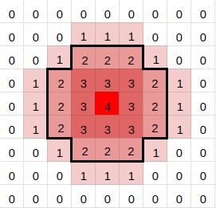
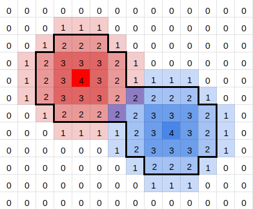

# metaballs

Simple metaballs simulation using quip

## How does it work?

Metaballs are functions that represent circles (or spheres), essentially they are a function of position that falls off the further you get from the centre of the metaball. By choosing a threshold value we can define a radial distance from the center of a metaball and fill in any pixel inside it.

Here we have a simple falloff function with a threshold value of 2:



When we have multiple metaballs we sum the values returned by their falloff functions and they begin to merge:



## Running locally

``` bash
lein run
```

## Build jar

``` bash
# Build
lein uberjar

# Run
java -jar target/uberjar/metaballs-0.1.0-standalone.jar
```
